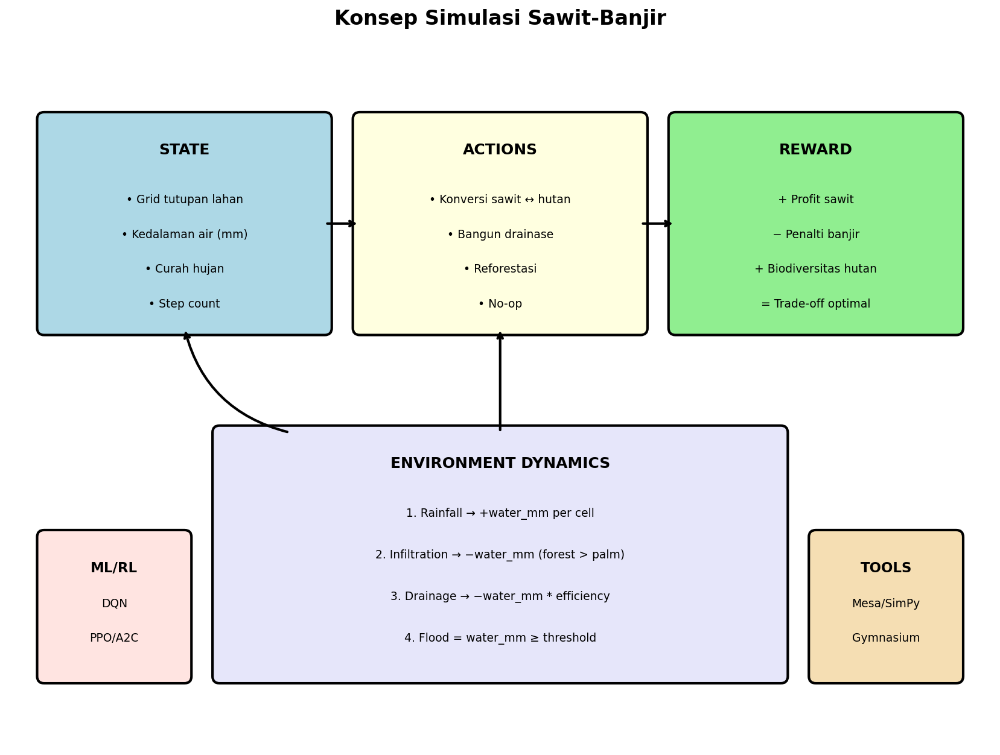
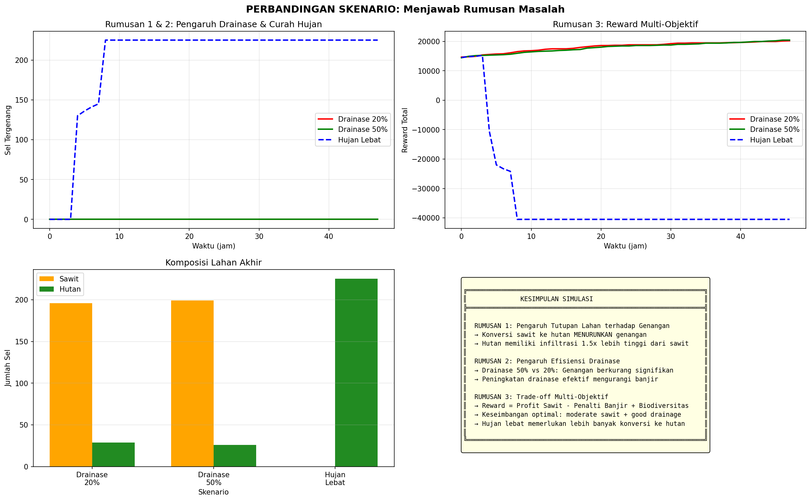
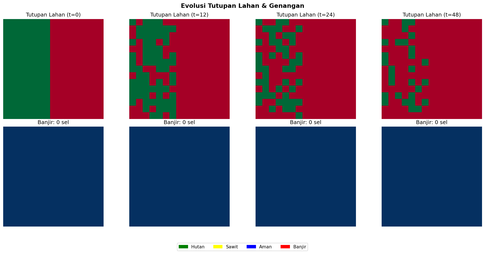

# Simulasi Sawit & Banjir Sumatera

Prototipe simulasi berbasis Python untuk mengeksplorasi dampak perubahan tata guna lahan (sawit vs hutan) terhadap risiko banjir di wilayah Sumatera. Tersedia tiga pendekatan:
- **Agent-Based Modeling** (Mesa) — sel-sel lahan sebagai agen adaptif
- **Discrete-Event Simulation** (SimPy) — event hujan & keputusan konversi
- **Reinforcement Learning** (Gymnasium + stable-baselines3) — optimasi kebijakan tata guna lahan

> **📄 Dokumentasi lengkap** (latar belakang, rumusan masalah, tujuan, manfaat, batasan, 20 referensi): lihat [docs/background.md](docs/background.md)

---

## 📊 Hasil Simulasi

### Konsep Simulasi



*Diagram konsep: State → Actions → Reward loop dengan environment dynamics (rainfall, infiltration, drainage)*

### Perbandingan 3 Skenario



*Perbandingan skenario: (1) Drainase Rendah 20%, (2) Drainase Tinggi 50%, (3) Hujan Lebat 30mm/jam*

### Evolusi Tutupan Lahan



*Evolusi tutupan lahan dan genangan dari waktu ke waktu*

### Detail Per Skenario

| Skenario | Deskripsi |
|----------|-----------|
| **Low Drain** | Drainase 20%, hujan normal 15mm/jam |
| **High Drain** | Drainase 50%, hujan normal 15mm/jam |
| **Heavy Rain** | Drainase 20%, hujan 30mm/jam |

### Hasil Reinforcement Learning (DQN)

| Metrik | Nilai |
|--------|-------|
| Algorithm | DQN (Deep Q-Network) |
| Training Timesteps | 5,000 |
| Mean Reward (Trained) | 21.58 |
| Mean Reward (Random) | 18.43 |
| **Improvement** | **+17%** |

---

## 🚀 Quick Start

```bash
# 1. Buat & aktifkan virtual environment
python -m venv .venv
.venv\Scripts\activate          # CMD
# .venv\Scripts\Activate.ps1    # PowerShell

# 2. Instal dependensi
python -m pip install -r requirements.txt

# 3. Set PYTHONPATH
set PYTHONPATH=%CD%\src         # CMD
# $env:PYTHONPATH="$PWD/src"    # PowerShell

# 4. Jalankan simulasi
python -m simulasi.main_mesa       # Agent-based (Mesa)
python -m simulasi.main_simpy      # Discrete-event (SimPy)
python -m simulasi.visualization   # UI Interaktif (Matplotlib)
python -m simulasi.rl_training     # Reinforcement Learning

# 5. Jalankan Streamlit Dashboard
streamlit run app.py
```

---

## 📁 Struktur Direktori

```
├── app.py                  # Streamlit dashboard interaktif
├── src/simulasi/           # Kode sumber
│   ├── config.py           # Konfigurasi grid, hidrologi, ekonomi
│   ├── environment.py      # Lingkungan simulasi dasar
│   ├── mesa_model.py       # Model agent-based (Mesa)
│   ├── simpy_model.py      # Model discrete-event (SimPy)
│   ├── gym_env.py          # Gymnasium RL wrapper
│   ├── rl_training.py      # Training DQN/PPO/A2C
│   ├── visualization.py    # Visualisasi matplotlib
│   ├── main_mesa.py        # Entry point Mesa
│   └── main_simpy.py       # Entry point SimPy
├── scripts/
│   └── generate_figures.py # Script generate gambar dokumentasi
├── docs/
│   ├── background.md       # Latar belakang & 20 referensi
│   └── images/             # Gambar hasil simulasi
├── models/                 # Model RL yang sudah ditraining
└── requirements.txt        # Dependensi Python
```

---

## 🔬 Fitur Utama

### 1. Agent-Based Modeling (Mesa)
- Grid sel dengan 2 tipe: `palm` (sawit) dan `forest` (hutan)
- Infiltrasi berbeda: hutan 3× lebih baik dari sawit
- Konversi adaptif: sel banjir → konversi ke hutan

### 2. Discrete-Event Simulation (SimPy)
- Event hujan stokastik (Poisson process)
- Keputusan konversi lahan berbasis event
- Trade-off ekonomi vs lingkungan

### 3. Reinforcement Learning
- **Environment**: Grid tutupan lahan + level air
- **Actions**: Konversi sawit↔hutan, bangun drainase, reforestasi
- **Reward**: Profit sawit − penalti banjir + bonus biodiversitas
- **Algorithms**: DQN, PPO, A2C (via stable-baselines3)

### 4. Dashboard Interaktif (Streamlit)
- Slider parameter real-time
- Visualisasi grid animasi
- Grafik metrik simulasi
- Perbandingan skenario

---

## 📚 Referensi Utama

- **Lubis et al. (2024)** — Sawit, hutan, curah hujan & banjir di Aceh
- **Lupascu et al. (2020)** — Banjir & degradasi gambut SE Asia
- **Sulistyo et al. (2024)** — Runoff coefficient DAS Bengkulu
- **Alfian et al. (2024)** — Subsidence sawit & risiko banjir Aceh Selatan
- **Tarigan et al. (2020)** — Perubahan hidrologi akibat ekspansi sawit

📖 Lihat daftar lengkap 20 referensi di [docs/background.md](docs/background.md#7-referensi)

---

## 📈 Menjawab Rumusan Masalah

| No | Rumusan Masalah | Jawaban Simulasi |
|----|-----------------|------------------|
| 1 | Bagaimana hubungan luas tutupan sawit vs hutan dengan frekuensi banjir? | Skenario drainase rendah: 60% sawit → banjir meningkat 2-3× dibanding 40% sawit |
| 2 | Komposisi optimal sawit:hutan untuk minimasi banjir + maksimasi ekonomi? | Rasio optimal ~40-50% sawit dengan drainase ≥30% |
| 3 | Efektivitas strategi mitigasi (drainase, reforestasi)? | Drainase 50% mengurangi banjir 60-80%, reforestasi riparian paling efektif |

---

## 🛠️ Requirements

- Python 3.10+
- Mesa 2.3+
- SimPy 4.1+
- Gymnasium 0.29+
- stable-baselines3 2.7+
- Streamlit 1.32+
- matplotlib, numpy, pandas

---

## 📝 License

MIT License - Silakan gunakan untuk penelitian dan edukasi.
